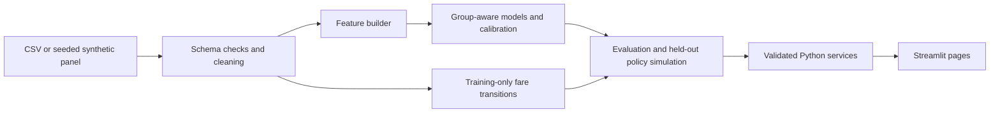

<div align="center">

# ✈️ FareWise

### AI-Powered Flight Fare Intelligence for India

Estimate fares, explore historical patterns, and get explainable book-or-wait guidance.

[🌐 **Open the live app**](https://vishnugajavada-farewise-srcfarewiseuiapp-fh8waa.streamlit.app/) · [📦 **GitHub repository**](https://github.com/vishnugajavada/Farewise)

FareWise uses a deterministic synthetic demo or a locally provided CSV. It makes no live fare API calls; synthetic results are demonstrations, not evidence of real fare performance.

</div>

---

## Repository

[GitHub source repository](https://github.com/vishnugajavada/Farewise)

## Architecture



## Windows PowerShell quick start

```powershell
py -3.11 -m venv .venv
.venv\Scripts\python.exe scripts\tasks.py setup
.venv\Scripts\python.exe scripts\tasks.py data
.venv\Scripts\python.exe scripts\tasks.py train
.venv\Scripts\python.exe scripts\tasks.py evaluate
.venv\Scripts\python.exe scripts\tasks.py simulate
.venv\Scripts\python.exe scripts\tasks.py test
.venv\Scripts\python.exe scripts\tasks.py lint
.venv\Scripts\python.exe scripts\tasks.py app
```

`data` selects the first CSV under `data/raw/` when available (`source: auto` in `configs/data.yaml`); otherwise it creates synthetic observations. `train`, `evaluate`, and `simulate` save artifacts and CSV outputs under `models/` and `data/processed/`. LightGBM is included in the project dependencies and compared when importable.

## Latest measured results

The current evaluation is **SYNTHETIC** and appears in [docs/EVALUATION.md](docs/EVALUATION.md). It includes unseen-flight GroupKFold and a held-out near-departure days-left block. Ridge and RandomForest are compared against three mean baselines; interval coverage uses a training-group calibration split. Do not interpret these simulated results as live or real-fare accuracy.

| Validation (SYNTHETIC) | Model / policy | MAE or mean saving (INR) |
| --- | --- | ---: |
| Unseen-flight GroupKFold MAE | Ridge | 2,793.54 |
| Unseen-flight GroupKFold MAE | RandomForest | 2,865.74 |
| Unseen-flight GroupKFold MAE | Best mean baseline (route/class/day bucket) | 3,106.94 |
| Held-out days-left <=14 MAE | LightGBM | 4,459.52 |
| Held-out days-left <=14 MAE | Best mean baseline (route/class) | 5,344.06 |
| Held-out policy mean saving vs book now | Advisor v1 / v2 | 0.00 |
| Held-out policy mean saving vs book now | Fixed 21-day rule | -135.68 |
| Held-out policy mean saving vs book now | Random day | -383.90 |

Ridge is the selected champion by unseen-flight mean absolute error; LightGBM performs best on the near-departure block. The champion's nominal 80% conformal interval achieved 78.9% coverage, below target. Both advisors tied immediate booking in this synthetic policy run; the hindsight oracle averaged ₹1,336.48 saving and is not an implementable strategy. SHAP global summary was generated; per-query explanations use a cohort fallback for the Ridge champion. Full results and downside slices are in `docs/EVALUATION.md`.

| Evidence | Output |
| --- | --- |
| Fold metrics and interval coverage | `models/fold_metrics.csv` |
| Validation summary | `models/evaluation_summary.csv` |
| Slice metrics, permutation drivers and SHAP summary | `models/slice_metrics.csv`, `models/drivers.csv`, `models/shap_summary.csv` |
| Fare-vs-days-left cohorts | `models/fare_curves.csv` |
| Held-out policy outcomes | `data/processed/policy_simulation.csv` |

## Data and limitations

The route picker includes 100+ Indian airport cities from the AAI airport directory. This is a destination catalog, not fare coverage: the current synthetic sample contains observations for six cities. Route estimates without a matching sample are labeled as broad class-wide fallbacks; route advice and quote checks report when route history is unavailable. A real CSV can be manually placed in `data/raw/`; review the source's current licence and attribution terms before use or redistribution. The commonly used Kaggle snapshot covers Feb–Mar 2022 and has no journey date. Synthetic panels cannot establish real-world predictive quality. Advice is descriptive decision support, never a guarantee or travel recommendation.

## Docker

Build and run with `docker compose up --build`, then open `http://localhost:8501`.

## Streamlit Community Cloud

The app is deployed at [vishnugajavada-farewise-srcfarewiseuiapp-fh8waa.streamlit.app](https://vishnugajavada-farewise-srcfarewiseuiapp-fh8waa.streamlit.app/). The source repository is [github.com/vishnugajavada/Farewise](https://github.com/vishnugajavada/Farewise).

## 👤 Author

**Gajavada Vishnu**
M.Tech Integrated Software Engineering — VIT Vellore (2021–2026)

[](https://www.linkedin.com/in/vishnu-gajavada-380631279/)
[](https://github.com/vishnugajavada)

---


---

> ⭐ If you found this project helpful, consider giving it a star!

